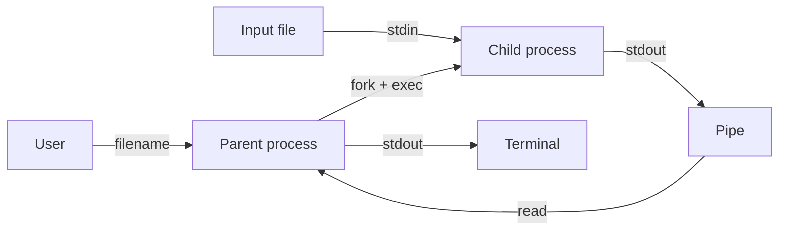

# Лабораторная работа №2

## Вариант 9

Родительский процесс создаёт дочерний процесс.

Пользователь вводит имя файла. Родитель открывает файл на чтение и перенаправляет его в стандартный поток ввода дочернего процесса.

Дочерний процесс читает строки вида:

```
число число число ...
```

Все числа имеют тип `float`. Первое число последовательно делится на все последующие числа строки, после чего результат выводится в стандартный поток вывода.

Если происходит деление на ноль, проверка выполняется в дочернем процессе, после чего дочерний и родительский процессы завершают работу.

Стандартный поток вывода дочернего процесса перенаправлен в `pipe`, из которого родитель читает результат и выводит его в свой `stdout`.

## Взаимодействие процессов



## Сборка из корня

```bash
cmake -S lab_02 -B build/lab_02
cmake --build build/lab_02
```

## Запуск

```bash
cd build/lab_02
./lab2_parent
```

Тестовые файлы находятся в:

```
lab_02/data/
```